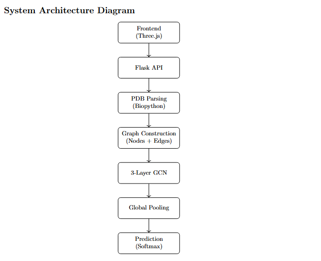

# 🧬 ProteinGraph-AI

> Converting protein structures into graphs and using AI to understand the language of life.

---

## 🚀 Overview

**ProteinGraph-AI** is a **Graph Neural Network (GNN)-based system** that analyzes protein structures and classifies enzymes using their **3D geometry**.

Instead of treating proteins as sequences, this project models them as **spatial graphs**, enabling deep learning models to capture structural relationships directly.

---

## 🎯 Why This Matters

* 🔬 Drug Discovery → Identify molecular targets for therapeutics
* 🧬 Disease Analysis → Understand impact of mutations
* ⚙️ Synthetic Biology → Engineer optimized enzymes
* 📚 Education → Interactive visualization of protein structures

---

## 🏗️ System Architecture



---

## 🧠 Core Idea

We convert proteins into graphs:

* **Nodes** → C-alpha atoms
* **Edges** → Spatial proximity (< 8 Å)
* **Graph** → Encodes 3D structure

Then apply a **Graph Convolutional Network (GCN)** to classify enzymes.

---

## ⚙️ Tech Stack

### Backend

* Python
* PyTorch
* PyTorch Geometric
* Flask
* Biopython

### Frontend

* HTML / CSS
* JavaScript
* Three.js (3D visualization)

---

## 🧪 Model Details

* **Architecture**: 3-layer GCN
* **Input**: 3D coordinates (x, y, z)
* **Pooling**: Global Mean Pooling
* **Output**: 6 Enzyme Classes

---

## 🎮 Features

### 🔗 Graph-Based Protein Representation

* Converts atoms → nodes
* Uses spatial proximity → edges

### 🎥 Real-Time AI Pipeline

* Visual step-by-step inference
* Graph construction → prediction

### 🧬 Mutation Simulation

* Simulates structural disruption
* Detects steric clashes
* Shows loss of function

### 🌐 Interactive 3D Visualization

* Rotate, zoom, explore proteins
* Color-coded folding patterns

### 📊 Insight Panel

* Enzyme function
* Organism details
* Structural insights

---

## ▶️ How to Run

### 1. Clone Repository

```bash
git clone https://github.com/your-username/ProteinGraph-AI.git
cd ProteinGraph-AI/backend
```

### 2. Install Dependencies

```bash
pip install -r requirements.txt
```

### 3. Start Backend

```bash
python app.py
```

Backend runs at:

```
http://127.0.0.1:5000
```

### 4. Run Frontend

```bash
cd ../frontend
python -m http.server 5500
```

Open in browser:

```
http://localhost:5500
```

---

## 🔄 Workflow

1. Select enzyme (PDB ID)
2. Backend:

   * Parse structure
   * Build graph
   * Run GNN inference
3. Frontend:

   * Visualize 3D protein
   * Display prediction and confidence
   * Enable mutation simulation

---

## 📦 Dataset

* Dataset is **automatically fetched** from the Protein Data Bank (RCSB PDB) during runtime.
* A small sample dataset can optionally be included for quick testing.

---

## 📈 Results

* Real-time enzyme classification
* Graph-based structural learning
* Scalable to thousands of proteins

---

## 🔮 Future Improvements

* AlphaFold integration
* Drug-binding prediction
* Cloud deployment
* Attention-based GNN (GAT)

---

## 👨‍💻 Authors

* Arjun Singh
* Himanshi Garg
* Ayushi Naharwal

---

## ⭐ If you like this project

Give it a star ⭐
